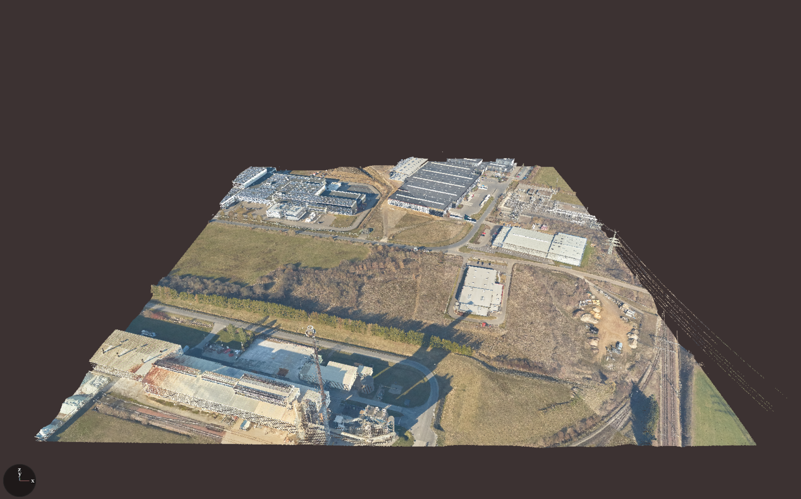
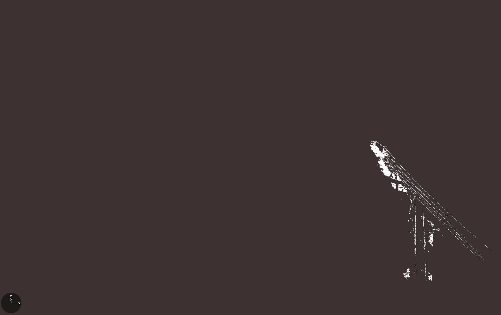

# PowerLine LiDAR Detector

LiDAR technology is widely used in geospatial data acquisition. In the energy sector, it helps capture point clouds to analyze risks around power lines. This project automates the processing of point clouds to detect power lines using a geometric-features-based algorithm.

## 📦 Installation

### 1️⃣ Install Python and Conda

- **Python:** [Python Downloads](https://www.python.org/downloads/)
- **Conda:**

  **Windows:** [Anaconda](https://www.anaconda.com/products/distribution)

  **Linux/macOS:**
  ```bash
  bash Anaconda-latest-Linux-x86_64.sh
  ```

### 2️⃣ Clone the repository

```bash
git clone https://github.com/Tury05/PowerLine-LiDAR-Detector.git
cd PowerLine-LiDAR-Detector
```

### 3️⃣ Create Conda environment

```bash
conda env create -f environment.yml
conda activate pl_detector
```

> The `environment.yml` includes Python, PDAL, and other necessary libraries.

### 4️⃣ Install Rust (if not installed)

Install Rust and Cargo:

```bash
curl --proto '=https' --tlsv1.2 -sSf https://sh.rustup.rs | sh
source $HOME/.cargo/env
```

Make sure `cargo` is in your PATH permanently:

```bash
echo 'export PATH="$HOME/.cargo/bin:$PATH"' >> ~/.zshrc  # or ~/.bash_profile for bash
source ~/.zshrc
cargo --version
```

### 5️⃣ Compile Rust modules and install Python project

From the project root:

```bash
./setup.sh
```

This script will:

1. Activate virtual environment.
2. Compile the Rust processing module (`lidar-processing`).
3. Compile the validation program (`confusion-matrix`).
4. Ensure all dependencies are ready.

## ⚡ Execution

### 1️⃣ Ground segmentation (Python module)

```bash
conda activate pl_detector
python src/ground_seg.py -g <input>
```

### 2️⃣ Power line detection (Rust module)

```bash
./rust_module/target/release/pl-detector <input> <output>
```

### 3️⃣ Vectorization (Convert Points to Polylines)

After extracting the power line points with the Rust module, you can optionally vectorize the point cloud into explicit 3D lines (`.ply` format). This will cluster separate wires and create continuous polylines.

```bash
python vectorize_wires.py <input.las> <output_directory>
```

**Parameters (Optional):**
- `--eps`: Distance for clustering wires (default: `0.8` meters). Lower this value (e.g., `0.5`) if parallel wires are being incorrectly merged.
- `--min_samples`: Minimum points needed to form a wire (default: `10`)
- `--bin_size`: Spacing between the generated line vertices (default: `1.0` meters)

Example:
```bash
python vectorize_wires.py outputs/filtered.las outputs/vectorized/ --eps 1.5 --bin_size 0.5
```

### 4️⃣ Metrics calculation

```bash
./rust_module/target/release/metrics <processed_tiles_folder> <ground_truth_tiles_folder> <original_tiles_folder>
```

## 📊 Visualizations

Comparison between the original LiDAR scan and the detected lines after execution (scanned in Luxembourg):
<table border="0">
  <tr>
    <td><br>Original LiDAR scan</td>
    <td><br>Lines detected by the LiDAR line detector</td>
  </tr>
</table>

## ✅ Notes

- Always activate the Conda environment before running Python scripts or Rust binaries.
- Ensure your terminal recognizes `cargo` and `python` commands.
- The `setup.sh` script automates compilation and installation for convenience.

## 📄 License

This project is licensed under the [MIT License](LICENSE).

## 📝 Citation

If you use this project in your research or publications, please cite as:

A.Ramos Rey, "Detección de líneas eléctricas en nubes de puntos LiDAR a través de un filtro basado en histogramas locales", Trabajo de Fin de Grado, Universidade da Coruña, 2022 (http://hdl.handle.net/2183/31909).
